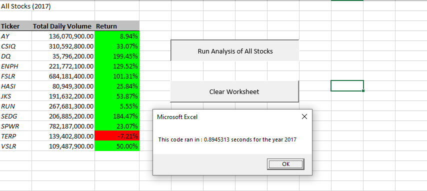
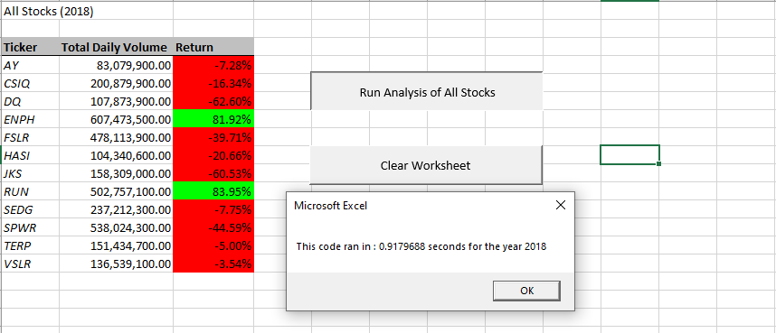
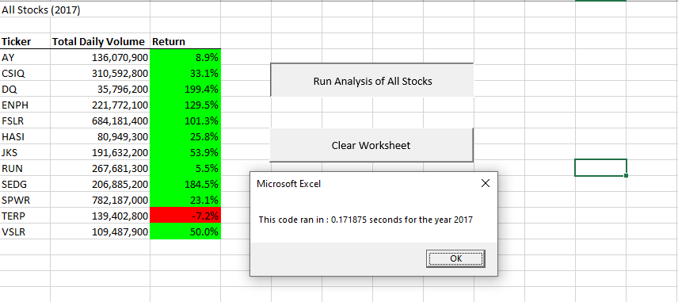
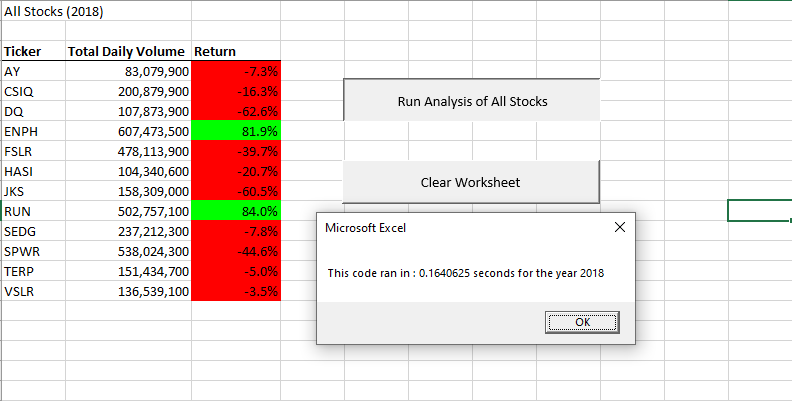

# **VBA Challenge**

## **Overview of Project**
The purpose of the analysis is to help Steve analyse the entire stock market over the last few years for his parents. We refractored the code for better logic of the code and performance to be able to analysis of entire stock market rather than just a few like in lesson example.

## **Results** 
### **Original Script**
####

#### 

### **Refractored Script**
####

####

The stock performance of 2017 was good with 'SEDG', 'DQ', 'ENPH' and 'FSLR' being the top 4 to have the best returns of more tham 100%. Only 'TERP' did bad with a negative return.
The stock performance of 2018 was pretty bad when compared to that of 2017. 2018 had only 'ENPH' and 'RUN' with positive returns of around 80%. Rest of the 10 suffered a negetive return with 'DQ', 'JKS' and 'SPWR' being the worst hit.
With the original script, the time for execution of the code was 0.89 sec and 0.92 sec for 2017 and 2018 respectively.
With the refractored script, the execution time came considerably down to 0.17 secs and 0.16 sec for 2017 and 2018 respectively.

## **Summary**
### Advantages or disadvantages of refactoring code
#### Advantages of Refractoring
Refractoring improves the design of the code.
It improves the code readability by :
		i. improving the logic of the code. 
		ii. creating a simpler and cleaner code.
		iii. reducing repitition of code.
It makes code more efficient and faster by taking fewer steps.
It also performs better.

#### Disadvantages of Refractoring
Refractoring of code could be expensive.
It may introduce some errors or bugs.

 ### How do these pros and cons apply to refactoring the original VBA script?
#### **Advantages of Refractoring the original VBA script**
The code post refractoring was **executed way faster**.
	* Before refractoring, we used the first loop 12 times to 		  loop thtough all the rows to calculate the total Volume, 	  startingPrice and endingPrice.	
	* Post refractoring, we used a single loop, but had a 	   	  condition to increment the ticker Index which iterated 	  	  through the 3 array loops to get output arrays.
We got 3 arrays as output of totalvolumes, startingPrices and endingPrices which **would retain the values** as against prior to refractoring; where we got varibales as output and would lose the values everytime the ticker would change.
Using single loop to get the output arrays **improved the logic and design of the code by **reducing repitition of calculation** as against the pre refractored code. 
Refractored code was easy to understand in terms of logic with better readability.

#### **Disadvantages of Refractoring the original VBA script**
Refractored code **consumed more memory** for storing the output values in array and would be **more expensive**.
